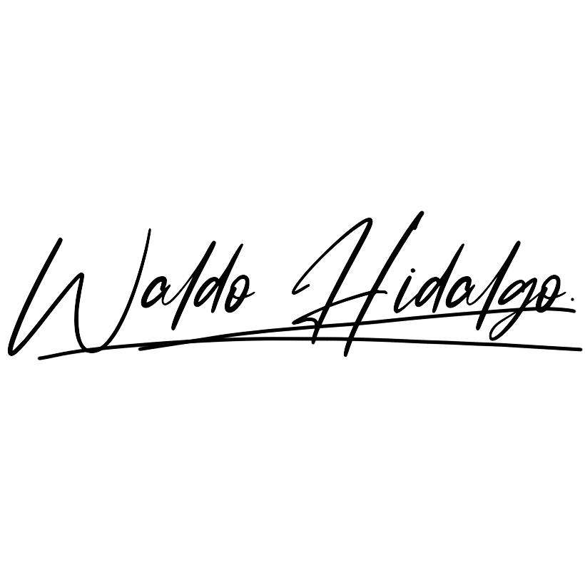
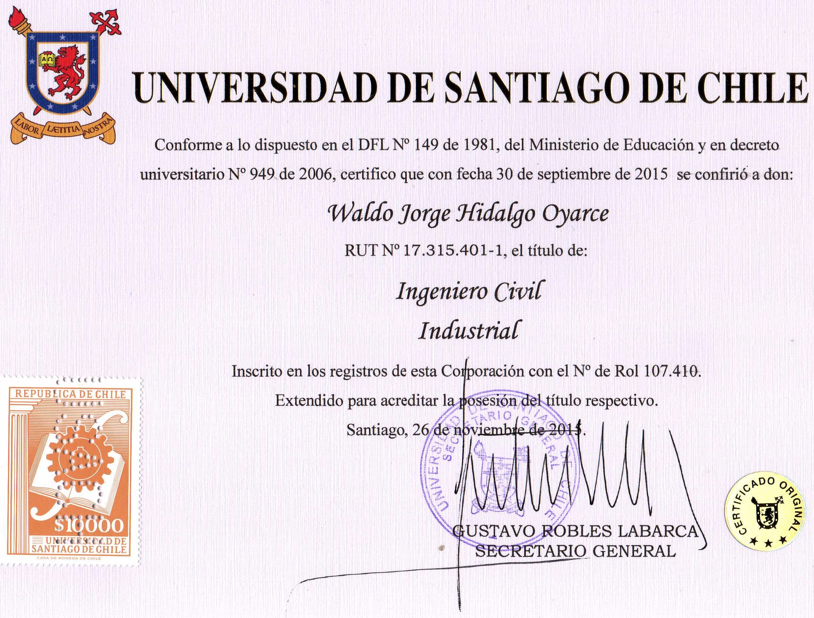

<h3 align="center">¡¡ Hola !! Mi nombre es Waldo Hidalgo Oyarce y sean bienvenidos a mi perfil en GitHub 👋</h3>

<picture  >
  <source media="(prefers-color-scheme: dark)" srcset="./logo_waldo_blanca.png">
  <source media="(prefers-color-scheme: light)" srcset="./logo_waldo_negra.png">
  
</picture>

 Mi profesión primera es <b>Ingeniería Civil Industrial</b> titulado en la Universidad de Santiago de Chile. En los últimos años he ido especializandome como Data Analyst y como Front End Developer. Actualmente, me encuentro profundizando mi conocimiento en JavaScript con miras a ser Fullstack.

<h3 align="center">Mis estudios y certificaciones a la fecha son la siguientes:</h3>

 Año 2002-2007: <a href="https://drive.google.com/file/d/1MiyuFI5yDvfRHyl3cBOVGuRCNdlzYOqI/view">Instituto Nacional José Miguel Carrera</a> orientación matemática egresado con promedio 6,0 sobre 7,0

 Año 2008-2015: <a href='https://usach.primo.exlibrisgroup.com/discovery/fulldisplay?context=L&vid=56USACH_INST:56USACH_INST&search_scope=MyInst_and_CI&isFrbr=true&tab=Everything&docid=alma990001681020206116'>Ingeniería Civil Industrial</a> Titulado con promedio 6,4 sobre 7,0

 Año 2022:

🎓 <a href='https://www.credly.com/badges/8d13bc87-9aa5-4dba-a021-dff9505fd88b'>Data Analyst by Coursera e IBM</a>

🎓 <a href='https://www.credly.com/badges/bd4a6a65-19a0-4e1b-8672-24ecad674e04'>Data Analyst in Power BI by Microsoft </a>

 Año 2023:

🎓 <a href='https://www.credly.com/badges/116c2f49-480b-4c18-9b69-2e2d87013713'>PCEP (Python Certified Entry-Level Programmer) Python Institute</a>

🎓 Front End Developer por el programa Oracle Next Education

🎓 <a href='https://www.credly.com/badges/33b76463-7e0b-4175-b303-f55a3e8d78ee'>JSE (JavaScript Entry Level Programmer) JavaScript Institute</a>

🎓 <a href='https://www.credly.com/badges/bb2d35f0-f04b-4081-8409-7cd3d2db4469'>Certificado Profesional en Business Model Canvas</a>

🎓 <a href='https://verify.w3schools.com/1O80CTRV9U'>Certified JavaScript Developer by W3Schools</a>

🎓 <a href='https://www.freecodecamp.org/certification/waldo-hidalgo/javascript-algorithms-and-data-structures'>Freecodecamp Javascript Algorithms And Data Structures Certification</a>

🎓 <a href='https://learn.microsoft.com/es-mx/users/waldohidalgo/credentials/5771358333a557e5'>Renovación por 1 año más de la Data Analyst in Power BI Certification by Microsoft </a>

🎓 Finalización Programa Oracle Next Education de manera completa: <a href='https://app.aluracursos.com/user/whidalgohp' target="_blank" rel="noopener">especialización Front End y Alumni One</a>

 Año 2024:

🎓 <a href='https://www.freecodecamp.org/certification/waldo-hidalgo/responsive-web-design'>Freecodecamp Responsive Web Design Certification</a>

🎓 <a href='https://www.freecodecamp.org/certification/waldo-hidalgo/front-end-development-libraries'>Freecodecamp Front End Development Libraries Certification</a>

<h3 align="center">🌐 Mis redes sociales son las siguientes:</h3>

            

 <h3 align="center" >💻 Tech Stack: Las tecnologías que manejo en distinto grado de habilidad son las siguientes:</h3>

<h3 align="center">📊 A continuación muestro un resumen de las estadisticas de mi perfil de github:</h3>

-Visualizaciones de mi perfil:

  

-Cantidad de Seguidores: 

<h3 align="center">🏆 Mis trofeos en GitHub </h3>

<h3 align="center">🔝 Mi repositorio con más contribuciones</h3>

<h3 align="center"> 😂 Memes Random para hacer más llevadera la programación</h3>

<h2 align="center">⚡Gráfico de Actividad:</h2>

<picture  align="center">
  <source media="(prefers-color-scheme: dark)" srcset="https://raw.githubusercontent.com/waldohidalgo/waldohidalgo/output/github-contribution-grid-snake-dark.svg">
  <source media="(prefers-color-scheme: light)" srcset="https://raw.githubusercontent.com/waldohidalgo/waldohidalgo/output/github-contribution-grid-snake.svg">
  
</picture>

La animación snake superior la he generado gracias al repositorio disponible [aquí](https://github.com/marketplace/actions/generate-snake-game-from-github-contribution-grid) en versión dark y normal
