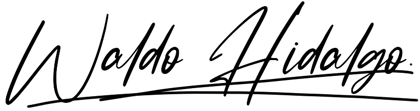

<h3 align="center">Hello !! My name is Waldo Hidalgo Oyarce and welcome to my profile on GitHub
 👋</h3>

<picture  >
  <source media="(prefers-color-scheme: dark)" srcset="./logo_waldo_blanca.png">
  <source media="(prefers-color-scheme: light)" srcset="./logo_waldo_negra.png">
  
</picture>

 My first profession is <strong>Industrial Civil Engineering</strong> graduated at the University of Santiago de Chile. In recent years I have specialized as Data Analyst and as Front End Developer and Fullstack Javascript Developer. The medium-term objective is to deepen javascript creating more complex projects from various platforms and obtain certifications. The long-term goal is to become fullstack developer in Python, PHP and Java and for that I have self-managed learning paths prepared.

<h3 align="center">My studies and certifications to date are the following:</h3>

 Year 2002-2007: <a href="https://drive.google.com/file/d/1MiyuFI5yDvfRHyl3cBOVGuRCNdlzYOqI/view">Instituto Nacional José Miguel Carrera</a> mathematical orientation graduated with an average of 6.0 out of 7.0

 Year 2008-2015: <a href='https://usach.primo.exlibrisgroup.com/discovery/fulldisplay?context=L&vid=56USACH_INST:56USACH_INST&search_scope=MyInst_and_CI&isFrbr=true&tab=Everything&docid=alma990001681020206116'>Industrial Civil Engineering</a> Graduated with an average of 6.4 out of 7.0

 Year 2022:

📠<a href='https://www.credly.com/badges/8d13bc87-9aa5-4dba-a021-dff9505fd88b'>Data Analyst by Coursera and IBM</a>

📠<a href='https://www.credly.com/badges/bd4a6a65-19a0-4e1b-8672-24ecad674e04'>Data Analyst in Power BI by Microsoft </a>

 Year 2023:

📠<a href='https://www.credly.com/badges/116c2f49-480b-4c18-9b69-2e2d87013713'>PCEP (Python Certified Entry-Level Programmer) Python Institute</a>

📠Front End Developer by Oracle Next Education

📠<a href='https://www.credly.com/badges/33b76463-7e0b-4175-b303-f55a3e8d78ee'>JSE (JavaScript Entry Level Programmer) JavaScript Institute</a>

📠<a href='https://www.credly.com/badges/bb2d35f0-f04b-4081-8409-7cd3d2db4469'>Professional Certificate in Business Model Canvas</a>

📠<a href='https://verify.w3schools.com/1O80CTRV9U'>Certified JavaScript Developer by W3Schools</a>

📠<a href='https://www.freecodecamp.org/certification/waldo-hidalgo/javascript-algorithms-and-data-structures'>Freecodecamp Javascript Algorithms And Data Structures Certification</a>

📠<a href='https://learn.microsoft.com/es-mx/users/waldohidalgo/credentials/5771358333a557e5'>Data Analyst in Power BI Certification by Microsoft renewed for 1 more year </a>

📠Completion Oracle Next Education Program in full: <a href='https://app.aluracursos.com/user/whidalgohp' target="_blank" rel="noopener">especialización Front End y Alumni One</a>

 Year 2024:

📠<a href='https://www.freecodecamp.org/certification/waldo-hidalgo/responsive-web-design'>Freecodecamp Responsive Web Design Certification</a>

📠<a href='https://www.freecodecamp.org/certification/waldo-hidalgo/front-end-development-libraries'>Freecodecamp Front End Development Libraries Certification</a>

📠<a href='https://www.hackerrank.com/certificates/7829e77204a0'>Hacker Rank Frontend Developer (React) Certificate</a>

📠<a href='https://www.freecodecamp.org/certification/waldo-hidalgo/back-end-development-and-apis'>Freecodecamp Back End Development and APIs Certification</a>

📠<a href='https://www.freecodecamp.org/certification/waldo-hidalgo/data-visualization'>Freecodecamp Data Visualization Certification</a>

📠<a href='https://www.freecodecamp.org/certification/waldo-hidalgo/quality-assurance-v7'>Freecodecamp Quality Assurance Certification</a>

📠<a href='https://www.freecodecamp.org/certification/waldo-hidalgo/information-security-and-quality-assurance'>Freecodecamp Legacy Information Security and Quality Assurance Certification</a>

🎓🎯🏆 <a href='https://www.freecodecamp.org/certification/waldo-hidalgo/full-stack'>Freecodecamp Legacy Full Stack Certification</a>

📠<a href='https://reinventate.desafiolatam.com/v/8EQhsCZUstmvwFwUfWeHZRNj'>Desafío Latam Fullstack Javascript Trainee</a>

🎓🎯🏆 <a href='https://www.freecodecamp.org/certification/waldo-hidalgo/legacy-front-end'>Freecodecamp Legacy Front End Certification</a>

📠<a href='https://learn.microsoft.com/en-us/users/waldohidalgo/credentials/5771358333a557e5'>Data Analyst in Power BI Certification by Microsoft renewed for 1 more year (2024-2025) </a>

<h3 align="center">🌐 My social networks are the following:</h3>

            

 <h3 align="center" >💻 Tech Stack: The technologies I handle in varying degrees of skill are:</h3>

<h3 align="center">📊 Below I show a summary of the statistics of my github profile:</h3>

-Views of my profile:

  

-Number of Followers: 

<h3 align="center">🏆 My trophies on GitHub </h3>

<h3 align="center">🔝 My repository with the most contributions</h3>

<h2 align="center">⚡Activity Chart:</h2>

<picture  align="center">
  <source media="(prefers-color-scheme: dark)" srcset="https://raw.githubusercontent.com/waldohidalgo/waldohidalgo/output/github-contribution-grid-snake-dark.svg">
  <source media="(prefers-color-scheme: light)" srcset="https://raw.githubusercontent.com/waldohidalgo/waldohidalgo/output/github-contribution-grid-snake.svg">
  
</picture>

I have generated the upper snake animation thanks to the available repository [here](https://github.com/marketplace/actions/generate-snake-game-from-github-contribution-grid) in dark and normal version
